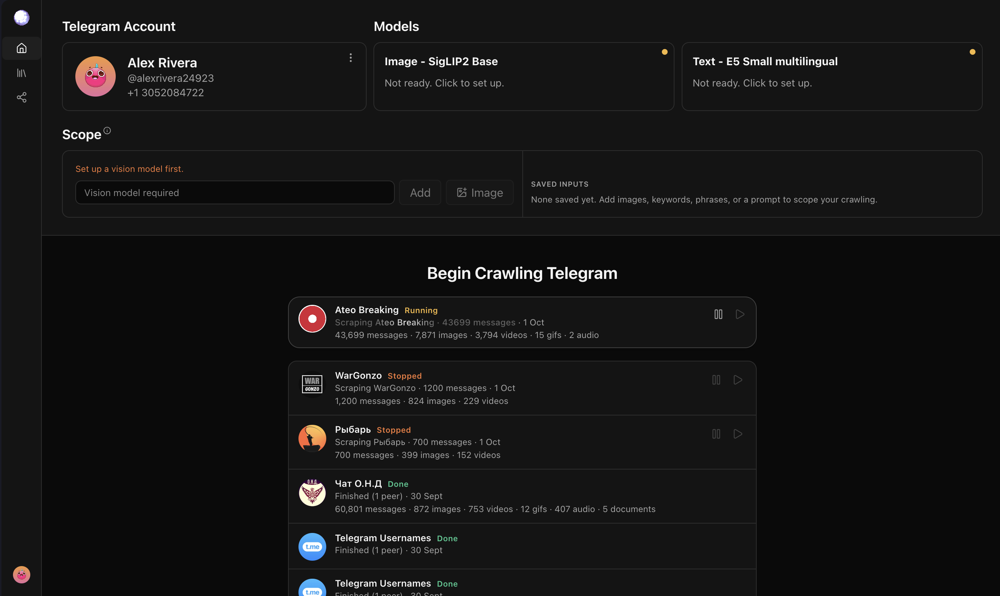
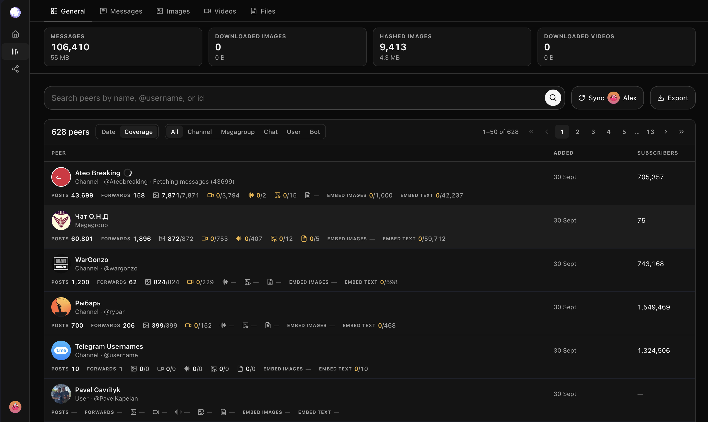
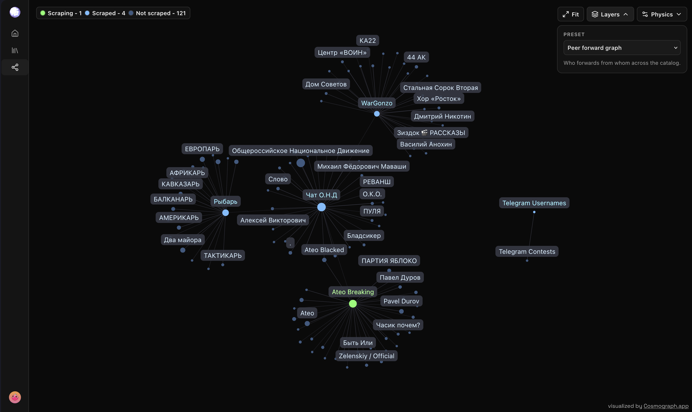

<div align="center">

<h1>
   Telegram Snowball
</h1>

**A telegram scraper and media analysis workbench.**<br>
Crawl  -  Collect  -  Process  -  Analyse

<p>
  <a href="#quick-start"></a>
  <a href="LICENSE"></a>
</p>

</div>

## What it does

- ❄️ **Forward snowball:** Start from a channel, scrape its messages, then walk Telegram forwards outward — one live job, with progress you can watch and stop.
- 🎯 **Seed search:** Type `@username` or a peer id, pick the hit, and set depth, media, and whether to embed while scraping.
- 🔭 **Scope:** Drop example images (or a caption, with a multimodal vision model). Rescore the catalog so the next snowball prefers channels that look like those examples.
- 📚 **Catalogs:** Browse peers, messages, images, videos, and files. Filter, search, open a peer, export a slice.
- 🧠 **Meaning search:** Once vectors exist, search messages and images by meaning — not just keywords.
- 🕸️ **Graphs:** Who forwards from whom, or **shared images** — the same photo in two chats even when it was never forwarded.
- 🖼️ **pHash:** Fingerprint photos so reused media clusters together, alongside vision embeddings.
- 🧩 **Local models:** Download a vision model (SigLIP / CLIP / MobileNet) and a text model (E5 / BGE) onto disk. Turn embedding off to scrape without them.
- 💬 **Your session:** Sign in once. Dialogues and profile photos load in the background. Media, models, and the session stay on this machine.

## Requirements

- [Docker](https://docs.docker.com/get-docker/) with Compose v2 (macOS, Linux, or Windows)
- A Telegram account and a [Telegram API app](https://my.telegram.org)

## Quick start

```bash
docker compose up --build
```

Then open **[http://127.0.0.1:8080](http://127.0.0.1:8080)**.

The first-run wizard walks through creating a Telegram API app, then signing in (phone → code → 2FA). After login you land on Home; dialogues (peer full + profile photos only) start loading in the background.

Compose services:

| Service | Role |
|---|---|
| `postgres` | Postgres 16 + pgvector |
| `api` | FastAPI on the compose network |
| `worker` | Scrape process; claims `fetch_dialogues` / `forward_snowball`; one Telethon session |
| `embed` | Torch sidecar; claims `download_model` / `embed`; HTTP encode for search and snowball |
| `client` | Static UI on loopback `:8080`, proxies `/api` |

Data that survives restart:

- Docker volume `snowball_pg` — database
- `./data` — media, embedding markers, `secret.key`

Stop with Ctrl+C, or `docker compose down`. Add `-v` only if you want to wipe the database volume.

## Screenshots

<p>
  
</p>
<p>
  
</p>
<p>
  
</p>
